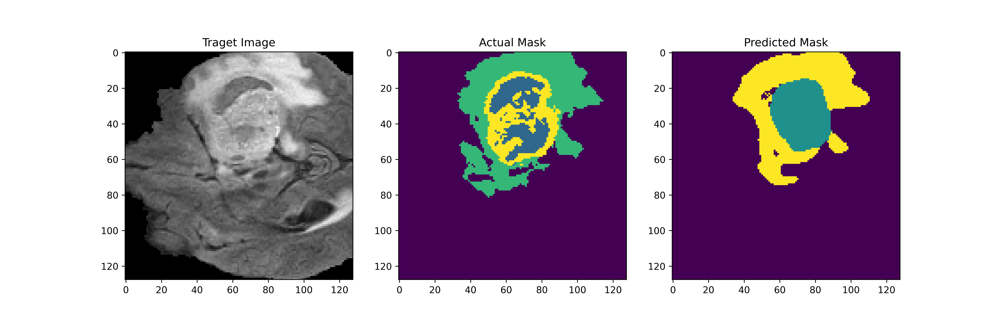

# Brain Tumor Segmentation

## Results :- 
> Version 3 

| DiceCoef   | IOU    | Recall   | Precision   |
|:----------:|:------:|:--------:|:-----------:|
| 0.80       | 0.68   | 0.78     | 0.82        |

> Version 2

| DiceCoef   | IOU    | Recall   | Precision   |
|:----------:|:------:|:--------:|:-----------:|
| 0.80       | 0.68   | 0.78     | 0.82        |

> Version 1 

| DiceCoef   | IOU    | Recall   | Precision   |
|:----------:|:------:|:--------:|:-----------:|
| 0.80       | 0.68   | 0.78     | 0.82        |

## Lessons Learned
After analyzing various results from different version of the model, I should have used a Weighted Loss function as the dataset contain less number of samples from classes 2 and 3

